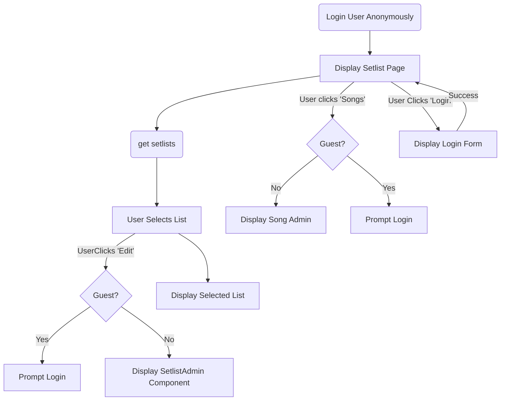

## Setlist Manager App

This was built to help my band track common setlists built on our song catalog. It allows us to store songs and add them to setlists. This makes it easy to save and quickly edit setlists as we add songs and play shows.

I am evolving it here to explore building an authenticated app with React and firebase. I'm using fiebase anonymous authentication to provide a basic read-only site. Logging in with an admin password enables all CRUD functions in the React UI. See the UI diagram below for moe details.

### Main Requirements

- Store songs band can play
- Store setlists of songs
- Starts in guest Readonly mode for selecting and viewing setlists
- Display setlist color-coded by singer or member instrument
- Auth protected admin
- Integrated design with Mike Slater sites
- Logged in users can directly edit setlist page and enter admin section of site

We need to arrange our setlists minimizing instrument changes for each band member. Color coding should assist in optimizing the setlists.

### Features

- Print view
- Admin to update members, instruments, songs, setlists
- Drag/Drop UI for setlist editings
- Mobile friendly setlist editing

### UI Flow - Guest and Admin

If no firebase authentication token exists, user is logged in as an anonymous Guest user. 

Guest users can only view existing setlists.They will be prompted to login if they attempt to use any admin features within the setlist page or navigate to the songs page.



## Run This Locally

Clone this repo and run `$ yarn install && npm run dev`

This uses `Vite` to run the application locally

### Firebase Setup

You will need a [firebase](https://console.firebase.google.com/) instance to run the data for this application. 

From your firebase console project settings, be sure you have a web-based app setup. Copy the `firebaseConfig` const from that page and export it from a new `/src/secrets.js` file.

```javascript
export const config = {
  apiKey: "",
  authDomain: "",
  projectId: "",
  storageBucket: "",
  messagingSenderId: "",
  appId: ""
};
```

