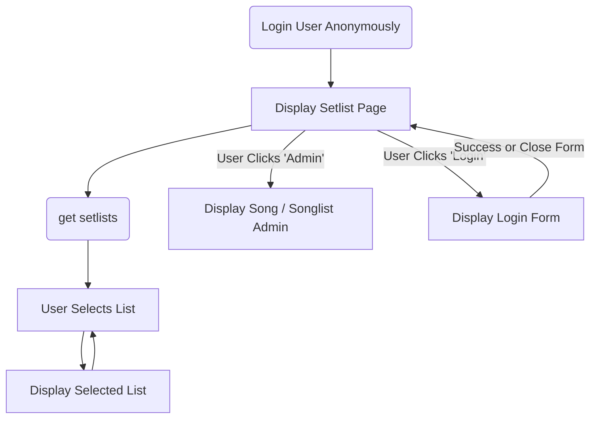

## Setlist Manager App

This was built to help my band track common setlists built on our song catalog. It allows us to store songs and add them to setlists. This makes it easy to save and quickly edit setlists as we add songs and play shows.

### Main Requirements

- Store songs band can play
- Store setlists of songs
- Starts in guest Readonly mode for selecting and viewing setlists
- Display setlist color-coded by singer or member instrument
- Auth protected admin
- Integrated design with Mike Slater sites
- Logged in users can directly edit setlist page and enter admin section of site

We need to arrange our setlists minimizing instrument changes for each band member. Color coding should assist in optimizing the setlists.

### Features

- Print view
- Admin to update members, instruments, songs, setlists
- Drag/Drop UI for setlist editings
- Mobile friendly setlist editing

### UI Flow

### Demo

[Github Pages](https://slatron.github.io/setlist-manager/)
